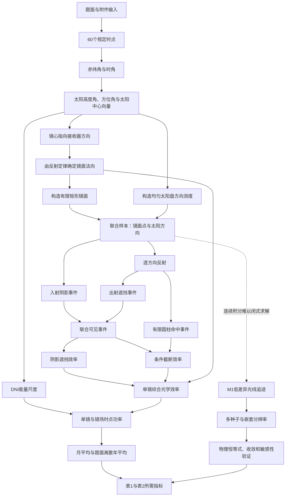

# Q1连续物理模型与逻辑主线

## 1. 本节解决的不是“怎样算得快”，而是“究竟在算什么”

问题一的目标不是直接套用光学效率乘积公式，而是建立从太阳辐射到集热器接收能量的完整映射。只有先明确每一束能量经历的物理过程，阴影遮挡效率、截断效率和镜场功率才具有一致的定义；采样方法、GPU分块和收敛阈值都只能放在这个连续模型之后。

因此，将Q1分成四个层次：

1. **题面输入层**：日期、时点、地理参数、镜场坐标、镜面尺寸、塔和集热器几何；
2. **连续物理层**：太阳方向、镜面姿态、入射与反射光路、镜间相交、接收器命中和能量比例；
3. **指标聚合层**：单镜效率、时点功率、月平均和题面离散年平均；
4. **数值实现层**：用低差异光线追迹估计连续积分，并用基线、恒等式和收敛实验验证。

前三级共同构成模型，第四级只是求解模型。不能因为某种算法容易实现，就反过来修改前三级的物理定义。

## 2. 题面事实、必要定义与简化假设的边界

### 2.1 直接来自题面的事实

- 镜场坐标系为$x$轴向东、$y$轴向北、$z$轴竖直向上；
- Q1塔位为$(0,0)$，集热器中心高度为80 m；
- 集热器是高8 m、直径7 m的圆柱形外表受光式集热器；
- 1745面镜均为$6\times6$ m，镜心高度均为4 m，平面坐标由附件给定；
- 控制系统使太阳中心光线经镜心反射后指向集热器中心；
- 年均指标只使用每月21日的五个规定时点；
- 太阳角、DNI、大气透射率、光学效率乘积和镜场功率公式由题面附录给出；
- 镜面反射率取题面允许的常数0.92。

### 2.2 为使题面公式成为三维模型而必须补足的定义

- 太阳方位角从正北顺时针量取，并按上午、下午补足反余弦的象限；
- 吸收塔高度按题意解释为集热器中心高度，因此圆柱侧面为$x^2+y^2=3.5^2$且$z\in[76,84]$；
- 阴影指光到达目标镜面前被其他镜面截断，遮挡指反射后到达接收器区域前被其他镜面截断；
- 多面镜同时截断同一条光线时，只能将这条光线判为一次损失；
- 截断效率的分母是扣除阴影遮挡后的反射能量，因此必须定义为条件比例，而不能与阴影遮挡损失分别计算后随意相乘。

这些内容不是为了提高结果而加入的自由参数，而是使题面文字具有唯一可执行含义的必要定义。

### 2.3 会改变物理逼真度或统计解释的简化假设

- 用半角$4.65$ mrad的均匀pillbox太阳盘表示核心太阳锥；
- 不加入题面未提供的镜面斜率误差、面形误差和跟踪误差；
- 十二个月等权形成题面离散年平均；
- 到达题面所定义集热器侧面的能量全部计入输出热功率，不再引入未给出的吸收率。

这些假设必须公开，并通过太阳盘半角和月份权重敏感性说明其影响。它们不能伪装成题面事实。

## 3. 从规定时点到太阳辐射输入

### 3.1 离散时点集合

令

$$
\mathcal{T}=\{(m,h):m=1,\ldots,12;\ h\in\{9,10.5,12,13.5,15\}\}.
$$

集合$\mathcal{T}$共有60个元素。它不是对真实全年逐小时过程的完整积分，而是题面明确指定的代表时点集合。后文的“年平均”均指对该集合按批准权重得到的离散年平均。

### 3.2 太阳位置的推导顺序

对任一$t=(m,h)\in\mathcal{T}$，先由每月21日相对春分的天数$D_m$计算赤纬角$\delta_m$，再由当地时刻$h$计算太阳时角$\omega_h$：

$$
\sin\delta_m=
\sin\left(\frac{2\pi D_m}{365}\right)
\sin\left(\frac{2\pi}{360}\,23.45\right),
$$

$$
\omega_h=\frac{\pi}{12}(h-12).
$$

然后由题面球面几何关系计算高度角$\alpha_s(t)$：

$$
\sin\alpha_s(t)=
\cos\delta_m\cos\varphi\cos\omega_h
+\sin\delta_m\sin\varphi.
$$

题面只给出方位角余弦，因此还必须利用$\omega_h$补足象限。令

$$
C_\gamma(t)=
\frac{\sin\delta_m-\sin\alpha_s(t)\sin\varphi}
{\cos\alpha_s(t)\cos\varphi},
$$

则

$$
\gamma_s(t)=
\begin{cases}
\arccos C_\gamma(t), & \omega_h\leq 0,\\
2\pi-\arccos C_\gamma(t), & \omega_h>0.
\end{cases}
$$

这样定义后，太阳在上午位于东侧、下午位于西侧，正午位于南侧。由此得到从镜场指向太阳中心的单位向量

$$
\boldsymbol{s}(t)=
\begin{bmatrix}
\cos\alpha_s(t)\sin\gamma_s(t)\\
\cos\alpha_s(t)\cos\gamma_s(t)\\
\sin\alpha_s(t)
\end{bmatrix}.
$$

这一顺序不可颠倒：太阳方向既决定镜面姿态，也决定阴影方向和DNI。如果方位角象限错误，后续所有三维几何都会同时错误。

### 3.3 DNI是能量尺度，太阳向量是传播几何

在海拔$H=3$ km下，题面DNI公式化为

$$
\mathrm{DNI}(t)=1.366\left[
0.34981+0.5783875
\exp\left(-\frac{0.275745}{\sin\alpha_s(t)}\right)
\right]\ \mathrm{kW/m^2}.
$$

$\mathrm{DNI}(t)$给出垂直于太阳中心光线平面的能量通量；$\boldsymbol{s}(t)$给出光路方向。二者承担不同作用：DNI决定该时点可用能量的尺度，余弦效率负责把该能量投影到倾斜镜面，不能再把DNI重复投影到水平面。

## 4. 从太阳方向到每面镜的唯一姿态

第$i$面镜的镜心为

$$
\boldsymbol{c}_i=(x_i,y_i,4),
$$

集热器中心为$\boldsymbol{c}_R=(0,0,80)$。镜心指向集热器中心的单位向量为

$$
\boldsymbol{t}_i=
\frac{\boldsymbol{c}_R-\boldsymbol{c}_i}
{\|\boldsymbol{c}_R-\boldsymbol{c}_i\|}.
$$

太阳中心光线的传播方向是$-\boldsymbol{s}$。理想镜面反射公式为

$$
\mathcal{R}(\boldsymbol{d},\boldsymbol{n})
=\boldsymbol{d}-2(\boldsymbol{d}\cdot\boldsymbol{n})\boldsymbol{n}.
$$

控制要求

$$
\mathcal{R}(-\boldsymbol{s},\boldsymbol{n}_i)=\boldsymbol{t}_i.
$$

由入射方向与目标方向的角平分关系得到

$$
\boldsymbol{n}_i(t)=
\frac{\boldsymbol{s}(t)+\boldsymbol{t}_i}
{\|\boldsymbol{s}(t)+\boldsymbol{t}_i\|}.
$$

这不是经验拟合，而是反射定律和题面跟踪要求共同确定的唯一朝阳法向。余弦效率随即得到

$$
\eta_{\cos,i}(t)
=\boldsymbol{n}_i(t)\cdot\boldsymbol{s}(t)
=\sqrt{\frac{1+\boldsymbol{s}(t)\cdot\boldsymbol{t}_i}{2}}.
$$

法向只确定镜面所在平面。题面还要求上下边平行地面，因此取$\boldsymbol{k}=(0,0,1)$，定义

$$
\boldsymbol{e}_{w,i}=
\frac{\boldsymbol{k}\times\boldsymbol{n}_i}
{\|\boldsymbol{k}\times\boldsymbol{n}_i\|},
\qquad
\boldsymbol{e}_{h,i}=\boldsymbol{n}_i\times\boldsymbol{e}_{w,i}.
$$

第$i$面有限矩形镜面为

$$
\mathcal{M}_i(t)=\left\{
\boldsymbol{p}_i(u,v)=\boldsymbol{c}_i
+u\boldsymbol{e}_{w,i}(t)+v\boldsymbol{e}_{h,i}(t):
u,v\in[-3,3]
\right\}.
$$

至此，太阳位置已转化为每面镜在三维空间中的有限几何对象，才具备讨论阴影、遮挡和截断的条件。

## 5. 太阳不是单一方向：建立太阳盘方向测度

题面指出太阳光具有锥形角，但没有给出周日比CSR或现场太阳形状。按已批准的2A口径，以$\theta_\odot=4.65\times10^{-3}$ rad的均匀pillbox作为核心太阳盘。

对每个$t$，在$\boldsymbol{s}(t)$的正交平面内构造单位基$\boldsymbol{a}(t),\boldsymbol{b}(t)$。太阳盘内方向写为

$$
\boldsymbol{s}'(t,\theta,\psi)
=\boldsymbol{s}(t)\cos\theta
+\left[\boldsymbol{a}(t)\cos\psi+\boldsymbol{b}(t)\sin\psi\right]\sin\theta,
$$

其中$0\leq\theta\leq\theta_\odot$，$0\leq\psi<2\pi$。均匀pillbox是“单位立体角内辐射能量相同”，因此方向概率测度为

$$
\mathrm{d}\mu_s
=\frac{\sin\theta\,\mathrm{d}\theta\,\mathrm{d}\psi}
{2\pi(1-\cos\theta_\odot)}.
$$

这一定义解释了为何数值采样时应令$\cos\theta$均匀，而不是令$\theta$本身均匀。若令$\theta$均匀，会过度采样太阳盘中心附近，系统改变截断效率。

镜面余弦效率按题面跟踪中心方向$\boldsymbol{s}$定义，太阳盘展开主要用于阴影边界、反射光斑和截断。对均匀对称太阳盘，方向平均满足

$$
\mathbb{E}_{\mu_s}[\boldsymbol{s}']
=\frac{1+\cos\theta_\odot}{2}\boldsymbol{s}.
$$

因此，仅从整盘平均投影看，用中心方向计算余弦效率产生的相对差为

$$
1-\frac{1+\cos\theta_\odot}{2}
=\frac{1-\cos\theta_\odot}{2}
\approx5.41\times10^{-6}.
$$

该近似的影响远小于截断边界的不确定性，但论文仍应说明它是中心光线跟踪口径，而不是把太阳盘误当作真正平行光。

## 6. 用统一光线事件定义阴影、遮挡和截断

### 6.1 连续样本空间

对第$i$面镜和时点$t$，定义联合样本空间

$$
\Omega_i(t)=\mathcal{M}_i(t)\times\mathcal{S}(t),
$$

其中$\mathcal{M}_i$按面积均匀取点，$\mathcal{S}$按$\mu_s$取太阳盘方向。联合测度为

$$
\mathrm{d}\mu_i
=\frac{\mathrm{d}A}{A_i}\,\mathrm{d}\mu_s,
\qquad A_i=36\ \mathrm{m^2}.
$$

一个样本$\xi=(\boldsymbol{p},\boldsymbol{s}')\in\Omega_i(t)$代表：太阳盘中方向$\boldsymbol{s}'$的一小份能量射向镜面上的点$\boldsymbol{p}$。所有几何效率都在同一个样本空间上定义，这一点是避免重复扣损的核心。

### 6.2 入射阴影事件

从$\boldsymbol{p}$朝太阳方向回溯入射光路：

$$
\boldsymbol{q}_{\mathrm{in}}(\lambda)
=\boldsymbol{p}+\lambda\boldsymbol{s}',
\qquad \lambda>0.
$$

若该射线与任一其他镜面$\mathcal{M}_j(t)$相交，则太阳能量在到达目标镜$i$之前已被截断。定义入射可见指示量

$$
I_i(\xi)=
\begin{cases}
1, & \boldsymbol{q}_{\mathrm{in}}\text{不与任何 }\mathcal{M}_j,j\neq i\text{相交},\\
0, & \text{否则}.
\end{cases}
$$

### 6.3 对该太阳盘方向逐条反射

镜面法向由太阳中心方向确定，在时点$t$内保持$\boldsymbol{n}_i(t)$。对于太阳盘方向$\boldsymbol{s}'$，入射传播方向为$-\boldsymbol{s}'$，反射方向为

$$
\boldsymbol{r}_i'(\xi)
=-\boldsymbol{s}'
+2(\boldsymbol{s}'\cdot\boldsymbol{n}_i)\boldsymbol{n}_i.
$$

只有当$\boldsymbol{s}'=\boldsymbol{s}$时，中心反射光才严格指向$\boldsymbol{c}_R$。太阳盘边缘方向形成偏离中心的反射光线，正是有限光斑和截断损失的来源。

### 6.4 出射遮挡事件

从$\boldsymbol{p}$沿$\boldsymbol{r}_i'$追踪反射光。若在进入集热器高度区域前先与其他镜面相交，则发生遮挡。定义出射可见指示量

$$
O_i(\xi)=
\begin{cases}
1, & \text{反射光到达接收器区域前不与其他镜面相交},\\
0, & \text{否则}.
\end{cases}
$$

所有定日镜都位于近地面，而接收器位于$z\in[76,84]$ m。因此，对未命中圆柱的光线，以到达$z=84$平面作为遮挡检查终点不会漏掉地面镜间遮挡；对命中光线则以首次圆柱交点为终点。

### 6.5 有限圆柱命中事件

接收器有效受光面为

$$
\mathcal{C}=\{(x,y,z):x^2+y^2=3.5^2,\ 76\leq z\leq84\}.
$$

反射射线为

$$
\boldsymbol{q}_{\mathrm{out}}(\lambda)
=\boldsymbol{p}+\lambda\boldsymbol{r}_i',
\qquad \lambda>0.
$$

将$x,y$分量代入圆柱方程，得到

$$
a\lambda^2+b\lambda+c=0,
$$

其中

$$
a=r_x'^2+r_y'^2,
$$

$$
b=2(p_xr_x'+p_yr_y'),
$$

$$
c=p_x^2+p_y^2-R^2.
$$

取最小正根$\lambda_R$，并检查$p_z+\lambda_Rr_z'\in[76,84]$。由此定义命中指示量$H_i(\xi)\in\{0,1\}$。题面指定外表受光式圆柱，因此不把顶面和底面计入接收面。

## 7. 效率定义必须服从能量守恒关系

令光路未受阴影和遮挡的联合事件为

$$
V_i(\xi)=I_i(\xi)O_i(\xi).
$$

阴影遮挡效率定义为未被镜场阻挡的反射能量比例：

$$
\eta_{\mathrm{sb},i}(t)
=\int_{\Omega_i(t)}V_i(\xi)\,\mathrm{d}\mu_i(\xi).
$$

题面把截断效率定义为“集热器接收能量”除以“全反射能量减去阴影遮挡损失能量”。因此截断效率必须是条件概率：

$$
\eta_{\mathrm{trunc},i}(t)
=\frac{
\int_{\Omega_i(t)}V_i(\xi)H_i(\xi)\,\mathrm{d}\mu_i(\xi)
}{
\int_{\Omega_i(t)}V_i(\xi)\,\mathrm{d}\mu_i(\xi)
}.
$$

于是自动得到

$$
\eta_{\mathrm{sb},i}(t)\eta_{\mathrm{trunc},i}(t)
=\int_{\Omega_i(t)}V_i(\xi)H_i(\xi)\,\mathrm{d}\mu_i(\xi).
$$

右端正是“既未被镜场阻挡、又真正命中接收器”的联合能量比例。这个恒等式说明：

- 多镜相交不能逐镜累加损失，只能对每条光线记录一次布尔结果；
- 截断效率的分母不能使用全部镜面采样，而必须使用未被阴影遮挡的样本；
- 阴影遮挡效率和截断效率不能分别用互不相关的样本定义后直接相乘。

这不是数值技巧，而是题面效率乘积与能量守恒同时成立的必要条件。

## 8. 从几何效率到单镜功率

第$i$面镜到接收器中心的距离为

$$
d_{\mathrm{HR},i}=\|\boldsymbol{c}_R-\boldsymbol{c}_i\|.
$$

附件镜场中全部$d_{\mathrm{HR},i}<1000$ m，因此题面大气透射率公式适用：

$$
\eta_{\mathrm{at},i}
=0.99321-0.0001176d_{\mathrm{HR},i}
+1.97\times10^{-8}d_{\mathrm{HR},i}^2.
$$

镜面反射率取$\eta_{\mathrm{ref}}=0.92$。单镜综合光学效率为

$$
\eta_i(t)=
\eta_{\mathrm{sb},i}(t)
\eta_{\cos,i}(t)
\eta_{\mathrm{at},i}
\eta_{\mathrm{trunc},i}(t)
\eta_{\mathrm{ref}}.
$$

单镜输出热功率为

$$
E_i(t)=\mathrm{DNI}(t)A_i\eta_i(t),
$$

镜场输出热功率为

$$
E_{\mathrm{field}}(t)
=\sum_{i=1}^{N}E_i(t)
=\mathrm{DNI}(t)\sum_{i=1}^{N}A_i\eta_i(t).
$$

该能量链条中没有接收器吸收率。原因不是假定真实吸收率等于1，而是题目要求的“输出热功率”已经由上述公式定义；额外乘入未给参数会改变题目所定义的指标。

## 9. 从单镜、时点到月和年

Q1中全部镜面面积相同，故时点平均效率为

$$
\bar{\eta}_q(t)=\frac{1}{N}\sum_{i=1}^{N}\eta_{q,i}(t),
$$

其中$q\in\{\mathrm{sb},\cos,\mathrm{trunc},\mathrm{total}\}$。等面积条件下，逐镜等权与面积加权完全一致；这一性质不能未经说明推广到Q3的异尺寸镜场。

对月份$m$，五个时点等权形成月平均：

$$
\bar{\eta}_{q,m}
=\frac{1}{5}\sum_{h\in\{9,10.5,12,13.5,15\}}
\bar{\eta}_q(m,h).
$$

题面离散年平均采用十二个月等权：

$$
\bar{\eta}_{q,\mathrm{year}}
=\frac{1}{12}\sum_{m=1}^{12}\bar{\eta}_{q,m}
=\frac{1}{60}\sum_{t\in\mathcal{T}}\bar{\eta}_q(t).
$$

功率按相同时间权重聚合，但不能用“平均DNI乘平均效率”替代“时点功率的平均”，因为DNI与效率随时点共同变化：

$$
\bar{E}_{\mathrm{year}}
=\frac{1}{60}\sum_{t\in\mathcal{T}}
\mathrm{DNI}(t)\sum_{i=1}^{N}A_i\eta_i(t).
$$

单位镜面面积年平均输出热功率为

$$
P_A=\frac{\bar{E}_{\mathrm{year}}}{\sum_{i=1}^{N}A_i}.
$$

这一步明确区分了“效率平均”和“能量平均”，避免把两个相关变量的均值错误相乘。

## 10. 连续模型确定后，才进入数值求解

上述积分包含有限矩形之间的可见性、太阳盘方向和有限圆柱命中，难以直接得到闭式表达。M1不改变任何物理定义，只用数值积分近似第7节的连续积分：

1. 在镜面局部坐标$(u,v)$上按面积均匀生成低差异点；
2. 在太阳盘上按$\mu_s$生成低差异方向；
3. 对每个“镜面点--太阳方向”组合计算$I_i,O_i,H_i$；
4. 用布尔样本均值估计$\eta_{\mathrm{sb}}$和联合接收比例，再由条件关系得到$\eta_{\mathrm{trunc}}$；
5. GPU只并行执行相同的射线相交运算，不改变样本空间、效率定义或能量公式。

B1也不是另一套物理模型，而是同一连续模型的低分辨率近似：用规则网格和中心方向近似阴影遮挡，并以较少太阳盘方向估计截断。它的作用是发现实现错误和量化离散近似偏差，不能因为计算快就替代已经通过收敛检查的M1。

## 11. 模型验证必须对应逻辑链中的具体环节

| 逻辑环节 | 必须验证的机械结论 | 失败意味着什么 |
|---|---|---|
| 太阳位置 | 60个$\alpha_s>0$，$\|\boldsymbol{s}\|=1$，上午/下午象限正确 | 所有镜面姿态和DNI输入无效 |
| 镜面姿态 | $\mathcal{R}(-\boldsymbol{s},\boldsymbol{n}_i)=\boldsymbol{t}_i$ | 反射定律或法向符号错误 |
| 有限镜面 | 局部轴正交归一，镜面点满足$u,v\in[-3,3]$ | 阴影相交区域错误 |
| 光路事件 | 人工构造阴影、遮挡、无遮挡情形得到预期布尔结果 | 可见性定义或射线方向错误 |
| 接收器 | 中心反射光全部命中有限圆柱侧面 | 圆柱方程、高度或根选择错误 |
| 效率分解 | $\eta_{sb}\eta_{trunc}=P(V\cap H)$ | 重复扣损或条件分母错误 |
| 邻域剪枝 | 局部候选与全场相交结果一致 | 加速改变了物理结果 |
| 数值积分 | 嵌套分辨率和多固定种子达到阈值 | 当前数值不足以代表连续模型 |
| 能量聚合 | 单镜求和、单位面积功率和MW换算恒等 | 聚合或单位错误 |
| 简化假设 | 太阳盘半角、月份权重敏感性低于预设触发值 | 结论依赖口径，需返回假设判断 |

验证通过只能说明“代码忠实并稳定地求解了已定义模型”，不能证明所有简化假设都等同于真实电站。论文必须分别陈述数学正确性和物理适用边界。

## 12. 全部建模流程

图中的实线表示物理量和指标的推导关系，虚线只表示从连续模型到数值求解器的近似关系。M1、GPU和采样数位于虚线之后，不能出现在模型定义之前。

## 13. 当前结论边界

本文件给出Q1的连续模型和逻辑结构，不使用计算结果证明模型合理。现有round1数值只能回答以下问题：

- 代码是否满足上述向量与能量恒等式；
- 当前数值离散是否已基本稳定；
- 已批准的太阳盘和月份权重扰动是否显著改变结果。

是否接受该模型作为论文主模型、是否保留暂定3A口径以及如何表述物理适用范围，仍属于建模者的最终判断。在该判断完成前，round1结果不冻结、不写入论文正式结果表。
