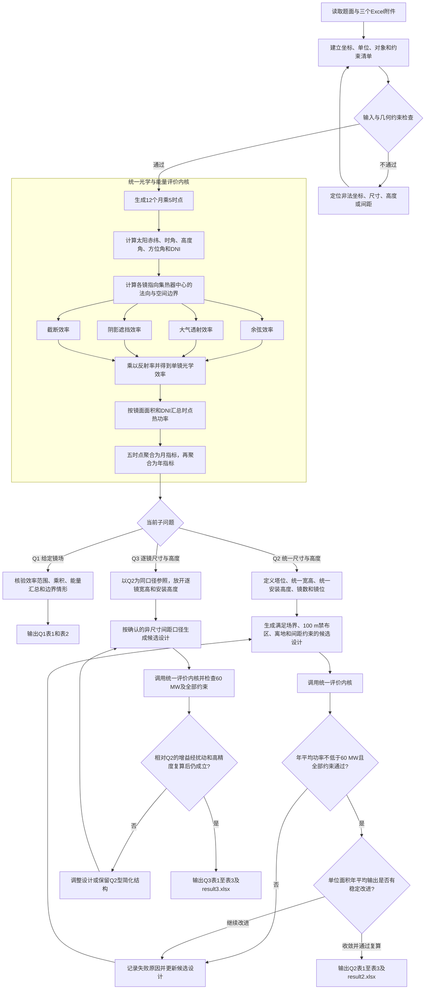

# 2023 A题：定日镜场优化设计流程图

## 题目结构

这道题不是三个彼此独立的问题。Q1应形成一个经边界情形和守恒关系核验的统一光学评价器；Q2和Q3只改变设计变量与约束检查，必须复用同一评价口径，才能比较结果。

## 关键计算链

1. **太阳输入**：由月份日期和当地时点得到太阳方向与DNI；上午/下午必须显式处理方位角象限。
2. **镜面姿态**：由太阳入射方向和镜心指向集热器中心的方向确定镜面法向，同时保持镜面上下边水平。
3. **效率分解**：分别计算余弦、大气透射、阴影遮挡、截断与反射效率，先做单项边界测试，再计算乘积。
4. **功率汇总**：按 `DNI × 镜面面积 × 单镜光学效率` 对全场求和；五时点形成当月21日平均，十二个月形成年平均。
5. **优化接口**：Q2/Q3只能调用同一个已核验评价器；目标为最大化单位镜面面积年平均输出，60 MW和全部几何规则是可行性条件。
6. **最终复算**：候选搜索阶段可使用明确记录的近似，但最终设计须用统一高精度口径复算，并保留功率裕量。

## 目前的建模边界

- 题面明确了效率的乘积结构，却没有给出太阳锥角及锥内能量分布；这会直接影响截断效率，需在冻结光学内核前确认。
- Q3中两面镜宽度不同时，“中心距离比镜面宽度多5 m”缺少成对口径；这会改变可行域，不能由AI静默决定。
- Q3中各镜面积不同时，镜场平均效率采用逐镜等权还是面积加权并未明示；该定义必须与镜场功率公式和表格口径一致。
- 题面没有明确镜面整体还是只有镜心必须落在场界和100 m禁布区之外，也没有明确十二个月是否等权；当前均作为待确认口径保留。
- 在进入具体方法筛选前，还需由建模者确认精度/搜索范围取舍、不可接受失败和实验计算预算。
